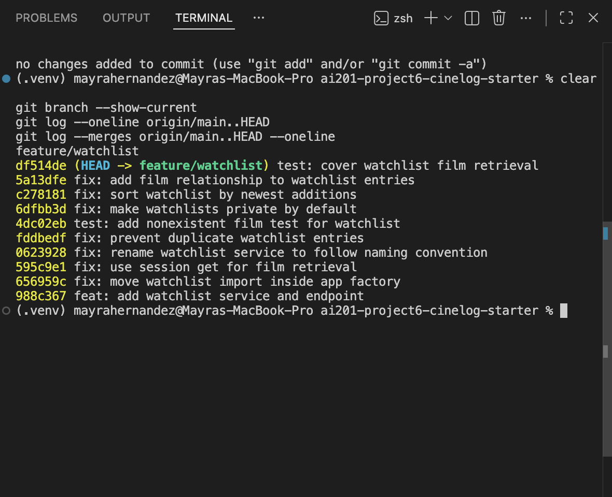

# PR Response Doc — CineLog Watchlist Feature

## AI Usage

I used ChatGPT as a tutor while navigating the CineLog codebase and responding to the review comments. I asked it to help me identify the existing patterns in `collection_service.py` and `test_collection.py`, including how the collection service checks for duplicates and how the tests verify a nonexistent film ID. I then adapted those patterns to the watchlist feature.

I also used ChatGPT to stress-test my reasoning for Comments 4 and 5. For the visibility decision, it explained the tradeoff between social sharing and privacy. I chose to make watchlists private by default because they may reveal personal interests, and users should intentionally decide when to share them.

For the sort-order decision, ChatGPT compared alphabetical sorting with newest-added-first sorting. I chose newest-added-first as the current default because it makes recent additions easier to find and matches the collection service. I added my own scope decision that alphabetical sorting could become a user-selectable option later, but should not be added in this pull request.

I also used ChatGPT for guidance during the rebase and interactive history cleanup. It helped me interpret the `.gitignore` and `models.py` conflicts and recognize that one existing commit contained two unrelated changes that should be split.

I verified the guidance myself by inspecting the relevant files and diffs, searching for function references, running the complete test suite after each change, and reviewing the final Git history. The final test run passed all five tests, and `git log --merges origin/main..HEAD --oneline` returned no output.

## Comment 1 — Rename

**What I did:**

I renamed `save_to_watchlist()` to `add_to_watchlist()` in `services/watchlist_service.py` so the function follows CineLog's `verb_to_noun` naming convention. I also updated the import and function call in `routes/watchlist/watchlist.py`.

**How I verified:**

I used a project-wide search for `save_to_watchlist` and confirmed that no old references remained. I then ran `pytest tests/ -v`, and all four existing tests passed.

## Comment 2 — Deduplication

**What I did:**

I added an `AlreadyInWatchlistError` exception and updated `add_to_watchlist()` to search for an existing `WatchlistEntry` with the same `user_id` and `film_id` before creating a new entry. If the film is already saved, the function raises the new exception instead of creating a duplicate. I followed the same deduplication pattern used by `add_to_collection()`.

**How I verified:**

I ran the full existing test suite with `pytest tests/ -v`, and all four tests passed. I also created a temporary in-memory database, added the same film to the same user's watchlist twice, and confirmed that the second call raised `AlreadyInWatchlistError` with the message `Film '1' is already in this user's watchlist`.

## Comment 3 — Missing test

**What I did:**

I created `tests/test_watchlist.py` and added
`test_add_to_watchlist_nonexistent_film_raises()`. The test creates an isolated in-memory database and a sample user, then calls `add_to_watchlist()` with a UUID that does not exist. It verifies that the service raises `FilmNotFoundError` rather than producing a database integrity error.

I followed the fixture and assertion structure used by `test_add_to_collection_nonexistent_film_raises()` in `tests/test_collection.py`.

**How I verified:**

I first ran:

`python -m pytest tests/test_watchlist.py -v`

The new test passed. I then ran the complete suite with:

`python -m pytest tests/ -v`

All five tests passed, including the four existing collection tests and the new watchlist test.

## Comment 4 — Default visibility

**Decision:**

I changed the default value of `public` from `True` to `False`.

**Reasoning:**

A watchlist may reveal a user's personal interests, so it should remain private unless the user intentionally decides to share it. Although privacy by default adds an extra step for users who want to publish their watchlist, it is the safer behavior because it prevents accidental sharing.

Users can still choose to make their watchlist public later.

**How I verified:**

I ran the complete test suite with:

`python -m pytest tests/ -v`

All five tests passed after the visibility default was changed.

## Comment 5 — Sort order

**Decision:**

I changed the default watchlist sort order from alphabetical by film title
to newest-added first.

**Reasoning:**

Sorting by `date_added` makes recently saved films easier to find and keeps the watchlist behavior consistent with the collection service. I agree that this is a more useful default for users who want to return to a film they just added.

Alphabetical sorting could still be useful for users with long watchlists, so a future improvement could allow users to choose their preferred sort order. I did not add that option in this pull request because it would expand the scope beyond the requested review change.

**How I verified:**

I ran the complete test suite with:

`python -m pytest tests/ -v`

All five tests passed after changing the sort order.

## Comment 6 — Rebase

**What I did:**

I fetched the updated `main` branch and rebased my
`feature/watchlist` branch onto `origin/main`.

The rebase first produced an add/add conflict in ` gitignore` because both my feature branch and the updated `main` branch had created that file. The version on `main` already contained all of my entries and also included ` pytest_cache/`, so I skipped my older, redundant `.gitignore` commit and kept the newer version from `main`.

The second conflict occurred in `models.py`. The updated `main` branch had migrated film IDs from integers to UUID strings, while my watchlist model still used an integer `film_id`. I resolved the conflict by keeping the UUID migration and updating `WatchlistEntry.film_id` to use `db.String(36)` with the `film.id` foreign key.

I also preserved my visibility decision:

`public = db.Column(db.Boolean, default=False)`

This kept watchlists private by default while making the watchlist model compatible with the updated UUID-based film model.

**How I verified:**

After resolving the conflicts and completing the rebase, I ran:

`python -m pytest tests/ -v`

All five tests passed.

I also ran:

`git log --merges origin/main..HEAD --oneline`

The command returned no output, confirming that the feature branch has a linear history with no merge commits.

## PR Description

### Feature Overview

This pull request adds a watchlist feature to CineLog. Users can save a film they want to watch and retrieve their saved films through the watchlist API. The service prevents the same user from adding the same film more than once and raises `FilmNotFoundError` when the requested film does not exist.

The feature supports these endpoints:

- `POST /watchlist/<user_id>/add`
- `GET /watchlist/<user_id>`

### Design Decisions

New watchlist entries are private by default. A watchlist can reveal a user's personal interests, so users should intentionally decide when to share it. This adds one extra sharing step, but it prevents accidental exposure.

Watchlists are sorted by newest-added first. This makes recently saved films easier to find and keeps the behavior consistent with CineLog's collection service. Alphabetical sorting could be added later as a user-selectable option, but it was not included here to keep this pull request focused.

### Manual Testing

1. Install the dependencies:

   `pip install -r requirements.txt`

2. Create a sample user and film:

   ```bash
   python - <<'PY'
   from app import create_app, db
   from models import User, Film

   app = create_app()

   with app.app_context():
       user = User(
           username="manualtester",
           email="manualtest@example.com",
       )
       film = Film(
           title="Manual Test Film",
           year=2026,
           genre="Drama",
       )

       db.session.add_all([user, film])
       db.session.commit()

       print("USER_ID:", user.id)
       print("FILM_ID:", film.id)
   PY

## Final Git History

The following screenshot shows the cleaned feature-branch history after
the interactive rebase. Each commit follows Conventional Commit format,
and the branch contains no merge commits.



